# Koffer Collector | RedHat OpenShift Operator Lifecycle Hub
## Provides
This automation provides a unified and standardized tarball of artifacts for
airgap infrastructure deployment tasks.

## About
Koffer Collector Operator Hub uses the Koffer Engine runtime container to enable
streamlined low side capture of all required artifacts for deploying OpenShift 
Operator Hub. Primarily built to enable airgaped environments in a standard 
"registry < to > mirror" workflow model conventional to more typical connected 
local mirror techniques.

Features:
  - High side sha256 verification of artifacts bundle before standup
  - High side artifacts served via generic docker registry container
  - Low side injestion direct to "pre-hydrated" registry stateful path

## Instructions:
### 1. Run Koffer Engine
```
 sudo podman run -it --rm \
     --entrypoint=/usr/bin/entrypoint \
     --volume /tmp/platform:/root/deploy:z \
     --volume /tmp/platform/secrets/docker/quay.json:/root/.docker/config.json:r \
  docker.io/containercraft/koffer:nightlies \
  https://repo1.dsop.io/dsop/redhat/platformone/ocp4x/ansible/operatorhub.git master
```
### 2. Move Koffer Bundle to target host /tmp directory
### 3. Extract to docker registry path
```
 tar -xv -f ${file} -C ${path}
```
# [Developer Docs & Utils](./dev)
# Demo

